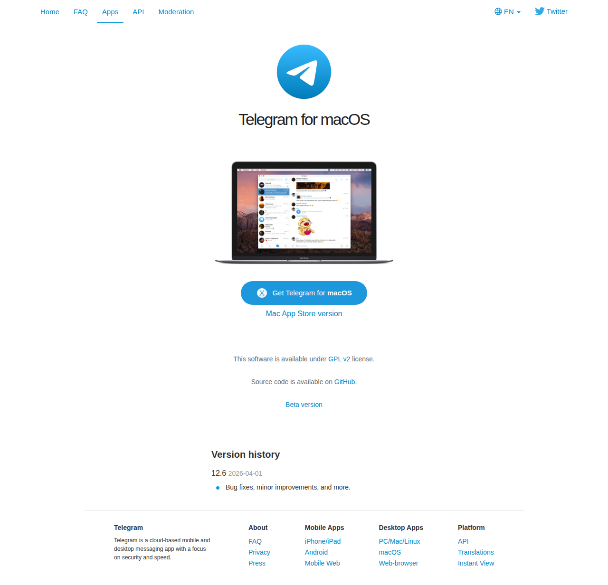

# Visited: https://macos.telegram.org/
**Time:** Tue May 12 11:21:46 UTC 2026

## Screenshot

## Raw HTML
[page.html](./page.html)

## Downloaded Media (1 files)
## Downloaded Media Files

## Other Links
- [#](#)
- [#v12-6-2026-04-01](#v12-6-2026-04-01)
- [/](/)
- [//core.telegram.org/](//core.telegram.org/)
- [//core.telegram.org/api](//core.telegram.org/api)
- [//desktop.telegram.org/](//desktop.telegram.org/)
- [//instantview.telegram.org/](//instantview.telegram.org/)
- [//macos.telegram.org/](//macos.telegram.org/)
- [//telegram.org/](//telegram.org/)
- [//telegram.org/android](//telegram.org/android)
- [//telegram.org/apps](//telegram.org/apps)
- [//telegram.org/apps#desktop-apps](//telegram.org/apps#desktop-apps)
- [//telegram.org/apps#mobile-apps](//telegram.org/apps#mobile-apps)
- [//telegram.org/blog](//telegram.org/blog)
- [//telegram.org/dl/ios](//telegram.org/dl/ios)
- [//telegram.org/dl/macos](//telegram.org/dl/macos)
- [//telegram.org/dl/macos/store](//telegram.org/dl/macos/store)
- [//telegram.org/dl/web](//telegram.org/dl/web)
- [//telegram.org/faq](//telegram.org/faq)
- [//telegram.org/moderation](//telegram.org/moderation)
- [//telegram.org/press](//telegram.org/press)
- [//telegram.org/privacy](//telegram.org/privacy)
- [//translations.telegram.org/](//translations.telegram.org/)
- [/css/bootstrap.min.css?3](/css/bootstrap.min.css?3)
- [/css/telegram.css?249](/css/telegram.css?249)
- [/img/website_icon.svg?4](/img/website_icon.svg?4)
- [/js/main.js?47](/js/main.js?47)
- [?setln=ar](?setln=ar)
- [?setln=be](?setln=be)
- [?setln=de](?setln=de)
- [?setln=en](?setln=en)
- [?setln=es](?setln=es)
- [?setln=fa](?setln=fa)
- [?setln=fr](?setln=fr)
- [?setln=id](?setln=id)
- [?setln=it](?setln=it)
- [?setln=kk](?setln=kk)
- [?setln=ko](?setln=ko)
- [?setln=ms](?setln=ms)
- [?setln=nl](?setln=nl)
- [?setln=pl](?setln=pl)
- [?setln=pt-br](?setln=pt-br)
- [?setln=ru](?setln=ru)
- [?setln=tr](?setln=tr)
- [?setln=uk](?setln=uk)
- [?setln=uz](?setln=uz)
- [https://github.com/overtake/TelegramSwift](https://github.com/overtake/TelegramSwift)
- [https://github.com/overtake/TelegramSwift/blob/master/LICENSE](https://github.com/overtake/TelegramSwift/blob/master/LICENSE)
- [https://telegram.org/dl/macos/beta](https://telegram.org/dl/macos/beta)
- [https://twitter.com/telegram_macos](https://twitter.com/telegram_macos)

## Stats
- Links: 55
- Media: 1
